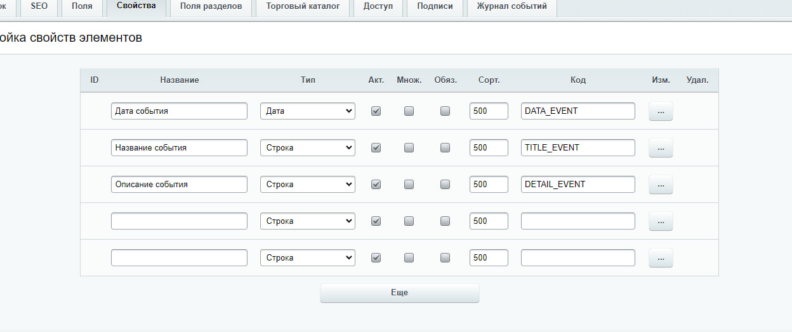
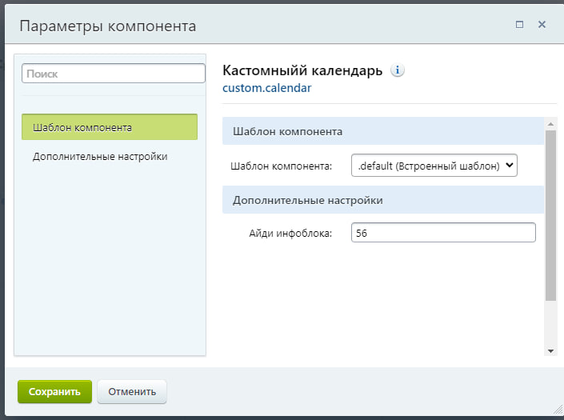
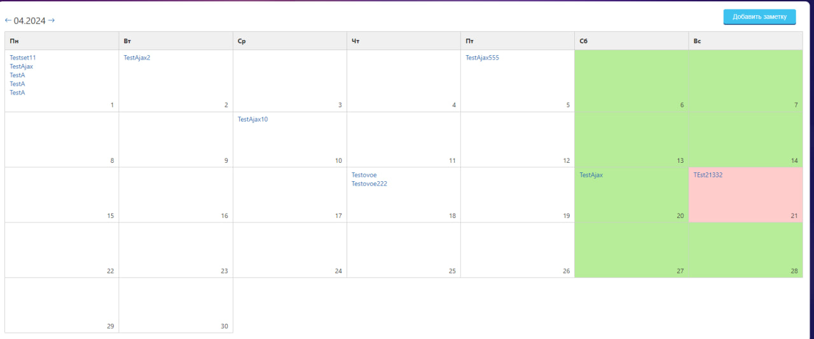
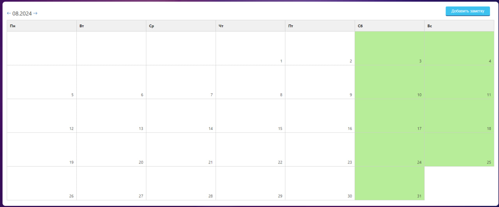
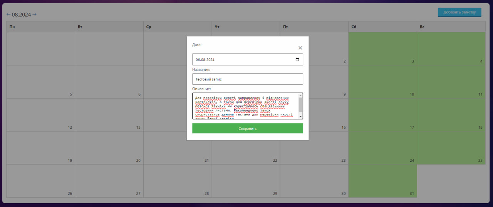
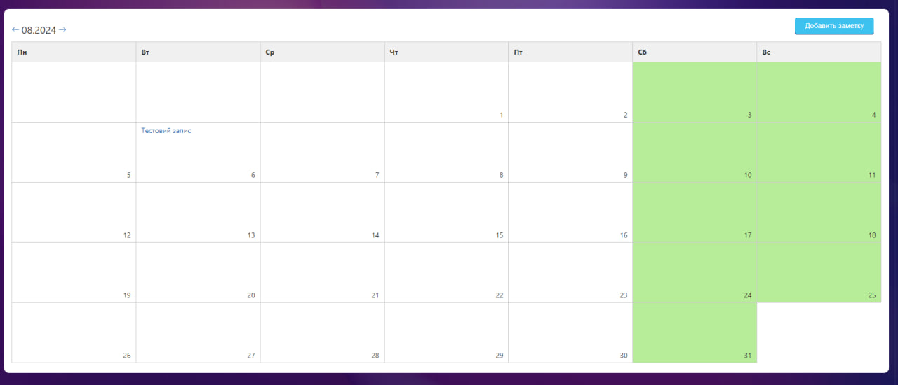
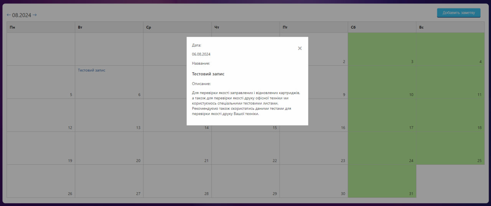

# Создание инфоблока для тестового задания

Для развертывания тестового задания необходимо создать инфоблок с указанными свойствами:

- Название инфоблока: [Кастомнный календарик]
- Символьный код: [CUSTOM_CALENDAR]
- Свойства инфоблока:
  - DATE_EVENT: [Дата]
  - TITLE_EVENT: [Строка]
  - DETAIL_EVENT: [Строка]

Также необходимо указать айди инфоблока в параметрах компонента.

## Небольшое примечание по работе календаря

Ниже представлен вид календаря

Календарь позволяет делать все описанное в задаче и сохраняет заметки в инфоблок, так же на заметку можно нажать и посмотреть: описание, название и дату.

